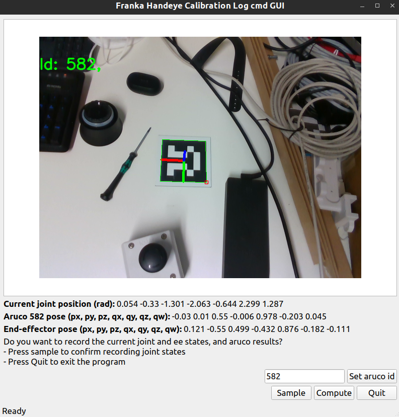
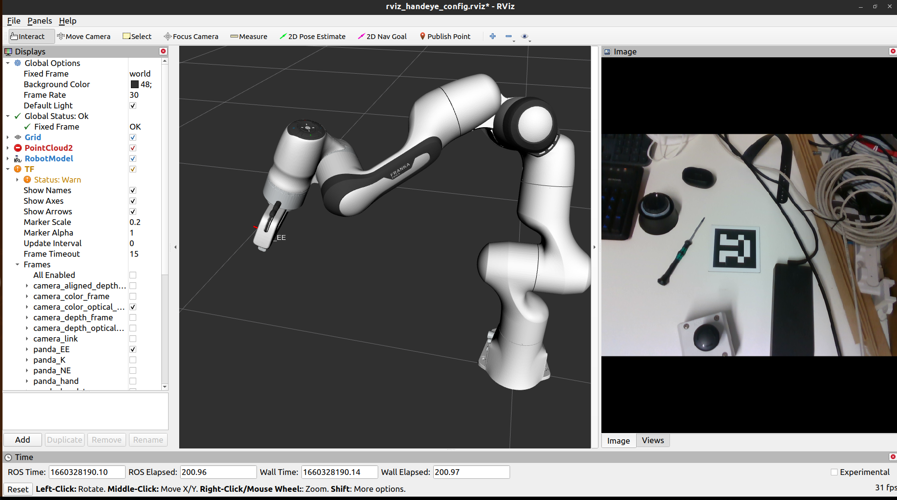
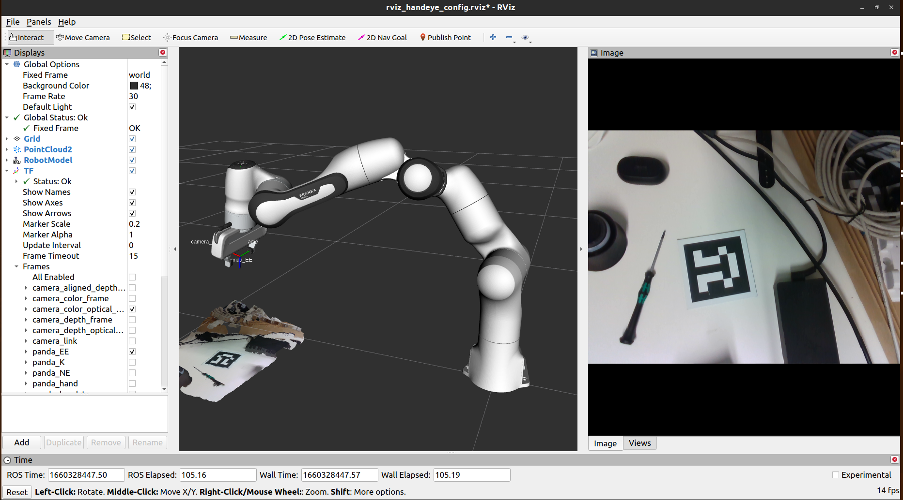

<!--
 * @Author: Dianye Huang
 * @Date: 2022-08-12 20:12:43
 * @LastEditors: Dianye Huang
 * @LastEditTime: 2022-08-12 20:26:05
 * @Description: 
-->

# structure

# how to do the calibration






```bash
roslaunch franka_handeye_cali handeye_cali_identify.launch
```
sample and compute

# how to load the calibration results

```bash
roslaunch franka_handeye_cali handeye_cali_pub_res.launch
```


```xml
<node name="gui_handeye_cali_node" pkg="franka_handeye_cali" type="gui_handeye_cali.py" args="" required="true" />
```