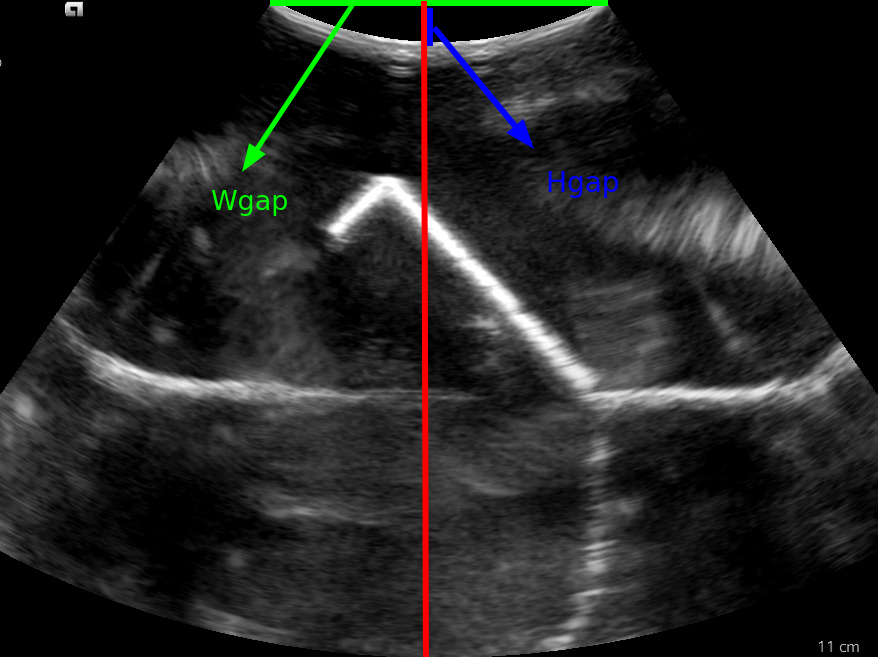

<!--
 * @Author: Dianye Huang
 * @Date: 2024-02-22 17:56:05
 * @LastEditors: Dianye Huang
 * @LastEditTime: 2024-02-23 10:53:40
 * @Description: 
-->

**Probe Type:** Convex 5C1
emition angle: 70 deg
probe tip in depth: 07.3 mm
probe tip in width: 46.4 mm
Image Resolutino: 657 x 878 (height x width)

**Cropping area:**
    x0: 521, x1: 1399, y0: 180, y1: 837

Detailed params: 
- **imaging depth:  7 cm**
hres (mm/px):  0.11764705882352941 , wres(mm/px):  0.0921672733754484
fixed hgap (mm):  7.294117647058823
fixed wgap (mm):  46.2679712344751
physical size (height x width, mm):  77.29411764705883 x 80.92286602364369
- **imaging depth:  8 cm**
hres (mm/px):  0.132890365448505 , wres(mm/px):  0.10395108331271052
fixed hgap (mm):  7.308970099667775
fixed wgap (mm):  46.36218315746889
physical size (height x width, mm):  87.30897009966777 x 91.26905114855984
- **imaging depth:  9 cm**
hres (mm/px):  0.14802631578947367 , wres(mm/px):  0.11502247597386321
fixed hgap (mm):  7.25328947368421
fixed wgap (mm):  46.00899038954528
physical size (height x width, mm):  97.2532894736842 x 100.9897339050519
- **imaging depth:  10 cm**
hres (mm/px):  0.16339869281045752 , wres(mm/px):  0.1288428177755611
fixed hgap (mm):  7.352941176470589
fixed wgap (mm):  46.64110003475312
physical size (height x width, mm):  107.3529411764706 x 113.12399400694265
- **imaging depth:  11 cm**
hres (mm/px):  0.17857142857142858 , wres(mm/px):  0.13988316146395408
fixed hgap (mm):  7.321428571428571
fixed wgap (mm):  46.44120960603275
physical size (height x width, mm):  117.32142857142857 x 122.81741576535168

# The notations are defined as below:

